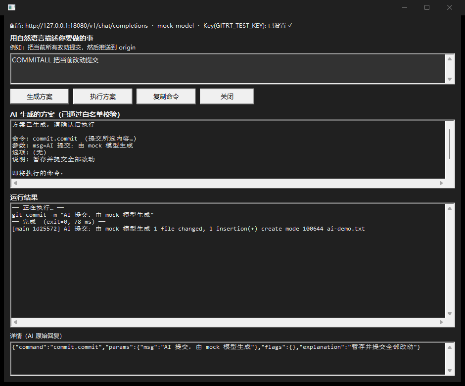
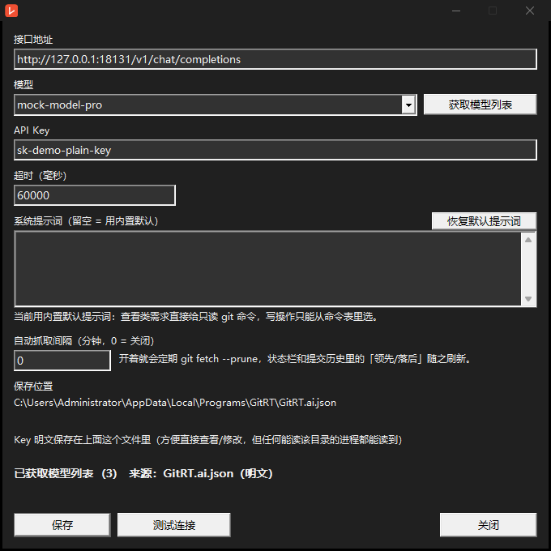
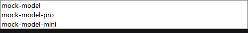

# GitRT（工作代号）

> 把 Git 的高频操作放回你**已经在的地方** —— Windows 11 资源管理器的**现代右键菜单**。
> 右键任意文件/文件夹 →「GitRT」→ 图形界面里挑操作，**不必记任何命令**；
> 参数面板与实时输出让它同时具备命令行级的表达力和可核对性。

本仓库是 **C++20 实现**（技术与决策记录见 [docs/产品设计.md](docs/产品设计.md) §0、[docs/技术实现设计.md](docs/技术实现设计.md)）。
零第三方依赖：Win32 + WinHTTP + COM，静态链接 CRT。

---

## 目录

- [它能做什么](#它能做什么)
- [界面](#界面)
- [快速开始](#快速开始)
- [AI 助手配置](#ai-助手配置)
- [测试](#测试)
- [开发期注册与打包](#开发期注册与打包)
- [CI（GitHub Actions）](#cigithub-actions)
- [项目结构](#项目结构)
- [常见问题](#常见问题)
- [设计边界（明确不做的事）](#设计边界明确不做的事)
- [文档与许可证](#文档与许可证)

---

## 它能做什么

| 能力 | 状态 |
| --- | --- |
| **右键菜单入口** | 资源管理器现代菜单里只放**一个「GitRT」**：点开主窗口，并把上下文切到你右键的目录/文件 |
| **AI 系统提示词** | 首选项里可编辑系统提示词（留空=内置默认，可一键恢复）；**查看类需求模型直接给只读 git 命令**（如 `git branch --show-current`）并校验执行，写操作仍只允许从命令表选 |
| **远端跟踪** | 所有提交以远端分支为基、往上累加：状态视图 `origin/main +2 / -1`，提交历史分【本地】/【远端】两段（落后时另有【远端新增】）；首选项可开**自动抓取**；「远端分支与地址」面板管理远端分支与远端地址 |
| **按提交还原** | 选一条提交：**只读检出**（默认，不动分支）/ 从它**新建分支** / 把当前分支**重置**到它（软·混合·硬）；执行前给真实命令与确认，硬重置丢弃改动时二次确认 |
| **面板自动显示 / 就地输出** | 查看类命令（提交历史/查看差异/文件历史）选中即显示内容并每 2.5s **自动刷新**；执行类命令的结果**就地**显示在「将执行的命令」下面的「运行结果」框里（不再另开进度窗口），运行中按钮变「取消」，结束必刷状态 |
| **克隆选项** | 「克隆到此处…」支持**深度（浅克隆）/单分支/指定分支/不拉标签/部分克隆（`--filter`）/递归子模块**；值型输入在构造期就校验（比如深度必须是正整数），不留到 git 报错 |
| **合并提交（squash）** | 在「合并提交」窗口里**复选连续的提交** → 合并成一条：改动 = 所有选中提交改动之和，提交信息 = 各 subject 自动拼接（可编辑）；带确认框与真实命令行日志；脚本里可用 `--squash` |
| **32 条命令**（含首选项/自检/AI 助手等内部命令） | 初始化 / 克隆 / 暂存 / 撤销 / 提交 / amend / 拉取 / 推送 / 抓取 / 同步 / 分支切换·新建·合并·变基·删除 / 历史 / 差异 / 文件历史 / 状态面板 / 储藏 / 清理 / 重置 / 维护 / 首选项 / 自检 / AI 助手 …… |
| **参数面板** | 每条命令的选项、参数、**即将执行的完整命令行实时预览**；危险操作需二次确认 |
| **执行反馈** | 点「执行」**立即**弹出执行窗口：标题与日志首行是**真实命令行**、输出实时流式回传、结束保留窗口（`Esc`/关闭）；结束后自动**重读 `git status`** 刷新状态面板与底部状态栏 |
| **状态面板 / 文本窗口** | 文件状态一览（暂存/未暂存/未跟踪）、差异、提交历史、自检报告，可复制 |
| **AI 助手** | 自然语言 → 结构化计划 → **白名单校验** → 参数面板 → 执行；只发路径/分支名/文件名，不发文件内容；`Internal` 命令禁止 AI 执行 |
| **AI 设置（首选项）** | 接口地址 / 模型（**从接口拉取列表后下拉选择**，也可手输）/ API Key / 超时 + **测试连接**；Key 明文存 exe 同目录 `GitRT.ai.json`（也可只用环境变量） |
| **CLI 门面（远端/还原）** | `--remote-info [--remote-fetch]` / `--set-upstream <up>` / `--remote-add name=url` / `--remote-set-url name=url` / `--remote-remove <name>` / `--restore <hash> --mode detach|branch|soft|mixed|hard [--branch <n>] [--force] [--dry-run]` |
| **CLI 门面（标签/发布）** | `--tag-list` / `--tag-create <name> [--annotated] [--message <m>] [--target <rev>] [--force] [--dry-run]` / `--tag-push <name> [--all] [--remote <r>]` / `--tag-delete <name> [--remote] [--force] [--dry-run]` / `--release-list` / `--release-create <tag> [--title <t>] [--notes <n>] [--generate-notes] [--draft] [--prerelease] [--push-tag] [--asset <file>]… [--dry-run]` |
| **CLI 门面** | `--run`（默认真执行，`--dry-run` 只预览）/ `--list-commands` / `--out` / `--cwd` / `--ai` / **`--squash <hashes>`**（合并连续提交，可脚本化）（脚本化、CI 可复现） |
| **右键菜单形态可切换** | 默认 `menu.mode=app`（只一个入口）；`"menu.mode": "tree"` 可回到分层菜单（8 分组 + 可选直达项/内联开关） |
| **图标一致** | 任务栏与右键菜单用**同一张** `packaging/Assets/gitrt.ico`（构建期同一份文件打进两个二进制） |
| Broker（状态缓存 / 目录监视 / 共享内存快照） | ⬜ 下一增量 |
| 图标覆盖（overlay icons） | ❌ 明确不做（与"只做现代菜单"的决策冲突，见产品文档 §3.9） |

进度、偏差与每次实测结论都记在 [docs/技术实现设计.md](docs/技术实现设计.md) §15–§16 与 [docs/支持矩阵.md](docs/支持矩阵.md)。

---

## 界面

| AI 助手：生成方案 → 执行 → 运行结果 | AI 设置：模型从接口拉取后选择 |
| --- | --- |
|  |  |

| 模型下拉列表（拉出来就能选） | 任务栏图标（与右键菜单同一张图） |
| --- | --- |
|  |  |

> 截图由 `tools/demo-ai-gui.ps1`、`tools/demo-ai-settings.ps1`、`tools/diag-taskbar-icon.ps1` 自动生成到 `docs/images/`。

---

## 快速开始

### 方式一：用发布包安装（普通用户）

**从哪儿下**（Actions 的 Artifacts 里有两种，别下错）：

| 产物名 | 是什么 | 要下吗 |
| --- | --- | --- |
| `GitRT-release` | **可发布包**：`GitRT-<版本>-win-x64.zip`（含 `install.ps1` / `uninstall.ps1` / `使用说明.txt` / `README.md` / `app\` / `package\`） | ✅ 装这个 |
| `gitrt-binaries-Debug` / `gitrt-binaries-Release` | 只有裸二进制（`GitRT.exe` / `GitRT.Shell.dll` / 探针）+ 自检报告，给开发排错用 | ❌ 不是安装包 |

打 tag（`v*`）时还会自动建 GitHub Release 并附上那个 zip。解压后**在解压出来的目录里**运行：

```powershell
pwsh -File install.ps1                    # 装到 <当前目录所在盘符的根>\gitRT + 写注册表 + 冒烟自检
pwsh -File install.ps1 -WithShellMenu:$false  # 只要程序，不注册右键菜单（默认 $true = 连菜单一起装）
pwsh -File install.ps1 -InstallDir D:\tools\GitRT   # 指定别的位置（仍然写注册表）
pwsh -File install.ps1 -DryRun            # 只看会装到哪、做什么

pwsh -File uninstall.ps1                  # 清注册表条目 + 删安装目录（先备份明文 API Key）
pwsh -File uninstall.ps1 -DryRun          # 只看会删什么
```

**安装位置由运行时的当前目录决定**（绿色安装，装到随手放的位置）：

| 你在哪运行 install.ps1 | 装到哪 |
| --- | --- |
| `A:\Downloads\GitRT-0.1.0.0-win-x64\` | `A:\gitRT\` |
| `C:\Users\me\Downloads\GitRT-…\` | `C:\gitRT\`（系统盘根目录通常要管理员 PowerShell） |

`install.ps1` 做四件事：① 检查 pwd／目标盘可写／发布包文件齐备；② 停掉在跑的 GitRT，
把 `app\` 里的二进制（`GitRT.exe` / `GitRT.Shell.dll` / `GitRT.ShellProbe.exe`）连同
`package\`（稀疏包清单与图标）、README/LICENSE、以及 `uninstall.ps1` 释放到 **`<盘根>\gitRT`**；
③ **写入注册表 `HKCU\Software\GitRT`**（`InstallDir` / `Version` / `InstalledAt` /
`UninstallString` / `ExePath`，用于卸载与自检，**不需要管理员权限**）；
④ 冒烟自检（跑一次 `--list-commands` 确认能启动、命令表正常）。

`uninstall.ps1` 反着来：从注册表拿到安装目录 → 把明文 `GitRT.ai.json` 备份到
`%APPDATA%\GitRT\uninstall-backup-<时间>\`（下次安装自动恢复）→ 停进程 → **删除目录** →
**删掉 `HKCU\Software\GitRT`** →（若注册过）注销稀疏身份包。重复执行不会报错。

现代右键菜单需要开发者模式（免签名注册稀疏包）；不装菜单也不影响主程序，
随时可以 `pwsh -File "<安装目录>\uninstall.ps1"` 卸载；想只装程序不装菜单用 `-WithShellMenu:$false`（默认是 `$true`，连菜单一起装）。

### 方式二：从源码构建（开发者）

**前置**：Windows 11（现代菜单需要 22H2+）、[git for Windows](https://git-scm.com/)、
MSYS2 UCRT64（g++ ≥ 13）、CMake ≥ 3.25、Ninja、PowerShell 7。

```powershell
# 构建（Debug / Release）
cmake --preset ucrt64-debug   -DCMAKE_MAKE_PROGRAM=A:/msys64/ucrt64/bin/ninja.exe
cmake --build build/debug

cmake --preset ucrt64-release -DCMAKE_MAKE_PROGRAM=A:/msys64/ucrt64/bin/ninja.exe
cmake --build build/release

# 组装发布包（app\ + package\ + 安装脚本 + zip → build/dist/）
pwsh -File packaging\scripts\build-release.ps1 -Config Release

# 装到当前用户（开发期路径：铺文件 + 免签名 loose 注册 + 重启 explorer）
pwsh -File packaging\scripts\dev-install.ps1 -Config Release
pwsh -File packaging\scripts\dev-uninstall.ps1
```

产物：

| 产物 | 位置 | 说明 |
| --- | --- | --- |
| `GitRT.exe` | `build/<cfg>/src/gui/` | GUI 主程序（`-mwindows`；脚本里用 `Start-Process -Wait` 调用） |
| `GitRT.Shell.dll` | `build/<cfg>/src/shell/` | 右键菜单扩展 `IExplorerCommand`（构建期强制校验导出表 + 无运行时 DLL 依赖） |
| `GitRT.ShellProbe.exe` | `build/<cfg>/src/shellprobe/` | 「无资源管理器」验证工具（`--dump` / `--self-test` / `--invoke` / `--shell-menu`） |

构建期选项：`GRT_DEV_REGISTER`（Debug 默认 ON / Release 默认 OFF）、`GRT_SHELL_PROBE`（菜单探针日志）、`GRT_BUILD_TOOLS`、`GRT_WERROR`。

手工启动（不注册菜单也能用）：

```powershell
build\release\src\gui\GitRT.exe "D:\some\repo"          # 打开主窗口并切到该仓库
```

---

## AI 助手配置

1. 打开 GitRT → 工具栏 **「首选项」**（或 AI 助手窗口里的 **「AI 设置」**）
2. 填 **API Key**；接口地址/模型默认指向 DeepSeek 官方，换服务就改
3. 点 **「测试连接」**（应显示 `连接正常 (HTTP 200)`，并**自动拉取模型列表**）→ 模型下拉选一个 → **「保存」**

存到哪里 / 优先级（`ai_client.h` 顶部有完整说明）：

```jsonc
// %LOCALAPPDATA%\Programs\GitRT\GitRT.ai.json   ← exe 同目录，明文
{ "endpoint": "https://api.deepseek.com/chat/completions",
  "model": "deepseek-chat",
  "apiKey": "sk-…",                 // 明文；界面里也能直接看到、直接改
  "apiKeyEnv": "DEEPSEEK_API_KEY",  // apiKey 留空时改从该环境变量读
  "timeoutMs": 60000 }
```

- 优先级：`GITRT_AI_*` 环境变量 > `GitRT.ai.json` > `config.json` 的 `ai*` 键 > 内置默认
- 模型列表：`GET <endpoint 的 base>/models`（`/chat/completions` 自动换成 `/models`），下拉框同时允许手输
- ⚠️ **明文落盘的代价**：任何能读该目录的进程都能读到 Key（界面里也这么写）。不想落盘就把 `apiKey` 留空、只设环境变量 `DEEPSEEK_API_KEY`。该文件已在 `.gitignore` 里
- 🔐 **卸载不会弄丢它**：`uninstall.ps1` 先把 `GitRT.ai.json` 备份到 `%APPDATA%\GitRT\uninstall-backup-<时间戳>\`，重装时 `install.ps1` 自动恢复（不想留备份用 `-NoBackup` / `-NoRestoreBackup`）
- 只想先试一遍、不花 Key：

```powershell
pwsh -File tools\mock-ai-server.ps1 -Port 18080   # 本地 OpenAI 兼容假模型
pwsh -File tools\demo-ai-gui.ps1                  # 自动跑完 AI 全流程并截图
```

命令行方式：

```powershell
build\release\src\gui\GitRT.exe --ai "把当前改动提交" --cwd .            # 只预览计划
build\release\src\gui\GitRT.exe --ai "把当前改动提交" --cwd . --ai-run   # 预览后执行
```

---

## 测试

```powershell
# 1) GUI 内置自检（porcelain 固件 / 命令表 dry-run / 安全闸门 / AI 设置与优先级 / 执行后状态刷新 / 图标）
Start-Process build\debug\src\gui\GitRT.exe -ArgumentList "--self-test=$PWD\build\selftest-gui.txt" -Wait

# 2) Shell 扩展自检（COM 接口 / 菜单树 / 复选开关 / 内嵌 msix 身份 / 性能预算）
build\debug\src\shellprobe\GitRT.ShellProbe.exe --self-test=build\selftest-shell.txt `
  --dll build\debug\src\shell\GitRT.Shell.dll --identity packaging\identity.json `
  --appx build\debug\packaging\AppxManifest.xml --workdir build\debug

# 3) 看一眼菜单树（在任意目录/文件上模拟右键）
build\debug\src\shellprobe\GitRT.ShellProbe.exe --dump $PWD --dll build\debug\src\shell\GitRT.Shell.dll

# 4) CTest（两个配置都跑）
ctest --test-dir build/debug --output-on-failure

# 5) 全量端到端（A–D 四个阶段：命令表 dry-run + 真实 git 断言 + AI 链路 + Shell 端到端）
#    注意：Exe 要放在工作区**外**，脚本默认用 %TEMP%\GitRT-run\（沙箱/权限原因）
Copy-Item build\debug\src\gui\GitRT.exe, build\debug\src\shell\GitRT.Shell.dll, `
          build\debug\src\shellprobe\GitRT.ShellProbe.exe "$env:TEMP\GitRT-run\" -Force
pwsh -File tools\test-all.ps1
```

界面级验证（会**真的开窗口**，跑几秒；断言 + 自动截图）：

| 脚本 | 覆盖 |
| --- | --- |
| `tools\demo-ai-settings.ps1` | 首选项 → 测试连接 → **模型下拉真的能拉出来** → 保存写盘 → 清空环境变量后仍能生成方案（16 项） |
| `tools\demo-ai-gui.ps1` | AI 助手全流程（输入提示词 → 生成方案 → 执行 → 结果），并截图 |
| `tools\demo-taskbar-icon.ps1` | exe 与 dll 的第一个图标**像素哈希相等**且 ≠ 系统通用图标（6 项） |
| `tools\diag-taskbar-icon.ps1` | 抓任务栏 + 按图标主色定位，确认图标真的画出来了 |
| `tools\diag-combo.ps1` | 组合框下拉诊断（rect / 行高 / 条目数 / `CB_GETDROPPEDSTATE` / `ComboLBox` 矩形） |
| `tools\demo-history.ps1` | 驱动 GUI 打开「提交历史」并读回正文，断言多行换行正确（9 项） |
| `tools\demo-squash.ps1` | 驱动 GUI 做完整合并：勾选连续两条 → 确认 → 断言提交数 -1、tree 不变、信息=拼接、日志里有真实命令行（17 项） |
| `tools\test-squash.ps1` | 合并的核心语义（含 HEAD / 不含 HEAD / 6 种拒绝）端到端（29 项） |
| `tools\test-clone.ps1` | 克隆选项端到端：`--depth=1` 真浅克隆（`.git/shallow` + 1 个提交）、非法深度被拦、完整克隆、仓库内子目录克隆不跑偏（15 项） |
| `tools\demo-live-panel.ps1` | 驱动 GUI 验证面板：查看类命令选中即显示内容、新提交 ~2.5s 内自动刷新、执行类命令输出就地显示且不另开窗口（14 项） |
| `tools\demo-ai-prompt.ps1` | 系统提示词端到端：自定义提示词确实进了请求体、留空回落到内置默认、首选项里能载入并保存（13 项） |
| `tools\test-remote.ps1` | 远端基线（远端前进→落后、本地提交→领先、两段标注）+ 上游设置 + 远端地址增删改 + **5 种还原**（检出/新建分支/软/混合/硬）+ 6 类拒绝（62 项） |
| `tools\ci-run-steps.ps1`（配 `tools\ci-extract-steps.py`） | 把 `.github/workflows/build.yml` 每个步骤抽出来在本机按序执行、模拟 `GITHUB_ENV`/`GITHUB_PATH` 传递——**推之前先在本机把 CI 跑一遍**（发现过"原生命令管道提前关闭导致步骤退出码 1"和"UCRT64_BIN 为空写坏 CMakeCache"两个坑） |
| `tools\test-install-uninstall.ps1` | install/uninstall 端到端：pwd→`<盘根>\gitRT`、注册表写入与清理、目录删除、AI 设置备份、幂等（21 项，真装真卸） |
| `tools\demo-remote.ps1` | 驱动 GUI：提交历史显示远端基线两段、远端窗口列出分支并抓取/设上游、还原窗口选提交→检出并确认（截图 `docs/images/remote-window.png`、`restore-window.png`） |

---

## 开发期注册与打包

```powershell
# 路径 A：传统注册（秒级，出现在「显示更多选项」）—— 先证明"实现是对的"
pwsh -File tools\dev\register-legacy.ps1            # 注册 + 重启 explorer
pwsh -File tools\dev\register-legacy.ps1 -Unregister

# 路径 B/C：现代菜单（需要身份包；默认走免签名 loose 注册，不需要 Windows SDK）
pwsh -File packaging\scripts\dev-install.ps1 -Config Debug   # 铺文件 + 注册 + 重启 explorer
pwsh -File packaging\scripts\dev-reload.ps1                  # 只改了 DLL 时用
pwsh -File packaging\scripts\dev-uninstall.ps1               # 卸载（独立进程，避免 0x80073CFA）

# 正式打包（需要 Windows SDK 的 makeappx/signtool）
pwsh -File packaging\scripts\build-msix.ps1 -Config Release
pwsh -File packaging\scripts\build-msix.ps1 -LayoutOnly     # 只组装稀疏包目录（免签名路径）
```

> ⚠️ 注册/升级后**必须重启 `explorer.exe`**，否则菜单不出现；只改 DLL 时不需要重新注册身份包。
> 若现代菜单不出现，先跑 `GitRT.ShellProbe.exe --dump` 排除"实现问题"，再查注册链路（[docs/支持矩阵.md](docs/支持矩阵.md) §4）。

---

## CI（GitHub Actions）

`.github/workflows/build.yml` 与本地完全同一套流程：

| 阶段 | 内容 |
| --- | --- |
| `build`（Debug + Release 矩阵） | MSYS2 UCRT64 工具链 → 配置/构建 → `ctest` → **GUI 自检**（命令表 / 安全闸门 / AI 设置 / 执行后状态刷新 / 图标）→ **Shell 自检 + 菜单 dump** → 上传产物 |
| `package` | 构建 Release → `build-release.ps1` 组装发布包（`app\` + `package\` + 安装脚本 + zip）→ 上传 zip |
| `release`（打 `v*` tag 时） | 下载 zip → `gh release create` 建 GitHub Release 并附上发布包 |

两个容易踩的点，workflow 里都处理了：

- **objdump 必须在 PATH 上**：根 `CMakeLists.txt` 用 `find_program(objdump)` 做 Shell DLL 导出表校验，找不到只会**告警并跳过**；CI 里显式把 `ucrt64/bin` 加进 `GITHUB_PATH`，并断言 CMakeCache 里确实有 `GRT_OBJDUMP`。
- **预设里的编译器路径写死本地开发机的 `A:/msys64`**：CI 用命令行 `-D` 覆盖成 runner 的 `C:/msys64`（命令行优先级高于 preset）。

> 需要"注册身份包 + 交互式桌面"的用例（`tools/test-all.ps1` 的 D 阶段、现代菜单聚合）**不在 CI 跑**，
> 因为在 runner 上要开发者模式与真实桌面会话；它们在本地按下面的「界面级验证」执行。

---
## 项目结构

```
src/core/        命令表、参数构造（argv 唯一来源）、git 执行引擎、配置、JSON 工具、AI 客户端
src/gui/         Win32 GUI：主窗口、参数面板、进度窗口、状态面板、文本窗口、AI 助手、AI 设置
src/shell/       右键菜单扩展：IExplorerCommand / IEnumExplorerCommand / 菜单模型 / 选区
src/shellprobe/  「无资源管理器」验证工具（--dump / --self-test / --invoke / --shell-menu）
cmake/           身份与 GUID 生成、Shell 导出表校验
packaging/       稀疏身份包清单、Assets（图标）、dev-install / dev-reload / dev-uninstall / build-msix
tools/           端到端与界面验证脚本、mock AI 服务、注册辅助
docs/            产品设计 / 技术实现设计 / 支持矩阵 / 调研材料 / 截图
```

设计要点（详见技术文档）：

- **argv 只有一个来源**：`command_spec.h` 的声明式命令表 → `command_builder`；菜单、参数面板、CLI、AI 全部走同一条路，AI 输出的"命令行"永远不会被直接执行
- 菜单请求通过**命名共享内存 + 管道 + 直接 `CreateProcessW`** 交给 GUI，不依赖 Broker
- 稀疏身份包只带来"现代菜单"能力，**不需要管理员权限**（安装在 `%LOCALAPPDATA%\Programs\GitRT`）

---

## 常见问题

**右键菜单里没有 GitRT**
先确认注册成功并**重启了资源管理器**：`Get-AppxPackage GitRT`；再跑 `GitRT.ShellProbe.exe --dump <目录> --dll <dll>` —— 探针能看到菜单说明实现没问题，问题在注册链路（[docs/支持矩阵.md](docs/支持矩阵.md) §4）。

**任务栏图标是空白的**
图标在**进程启动时**就固定了：换掉 exe 不影响已经在运行的窗口（关掉 GitRT 重开即可）。另外用 `Stop-Process -Force` 强杀 GitRT 会留下**没有图标的幽灵按钮**，鼠标悬停/点一下就消失。图标缓存陈旧可 `ie4uinit.exe -show` 或重启资源管理器。

**执行完状态没变**
当前版本执行结束会**重读 `git status`** 再刷新（`WM_GRT_STATUS_RELOAD(wp=1)`）——若仍是旧值，看执行窗口里的真实命令行与退出码（命令可能失败了）。

**AI 提示"未配置 API Key"**
见 [AI 助手配置](#ai-助手配置)：界面上填 Key 即可，或设置环境变量 `DEEPSEEK_API_KEY`（`setx` 后需重启资源管理器，从右键菜单启动的进程才会继承）。

**`首选项` 里的 Key 安全吗**
按产品决策**明文**保存在 `GitRT.ai.json`（方便查看/修改）。不想落盘就留空 `apiKey`、只用环境变量。凭据永不写日志，且该文件已被 `.gitignore` 忽略。

**只想用命令行**
`GitRT.exe --list-commands` 列全部命令；`--run <key> --cwd <仓库> --dry-run` 只看 argv（**不加 `--dry-run` 就真执行**）；`--out <file>` 把输出写文件（见 [docs/技术实现设计.md](docs/技术实现设计.md) §14）。

---

## 设计边界（明确不做的事）

- **不做图标覆盖（overlay icons）**：与"只做现代菜单"的平台决策冲突（产品文档 §3.9）
- **不做菜单里的直接命令**（默认形态）：右键只留一个入口，避免污染系统菜单；需要分层菜单可切 `menu.mode=tree`
- **不用第三方库**：Shell DLL 侧尤其不允许（解析、HTTP、JSON 全部自研并有单测）
- **不保存 git 凭据**：交给 Git Credential Manager / Windows 凭据管理器

---

## 文档与许可证

| 文档 | 内容 |
| --- | --- |
| [docs/产品设计.md](docs/产品设计.md) | 定位、平台约束（D1–D4）、命令清单、菜单语义、里程碑、风险、修订记录 |
| [docs/技术实现设计.md](docs/技术实现设计.md) | 工程结构、COM 实现、wire format、Git 引擎、AI、打包、测试落点、**进度与偏差记录** |
| [docs/支持矩阵.md](docs/支持矩阵.md) | M0 待实测项（S1–S6）结论、场景 × 菜单可见性矩阵 |
| [research-git-context-menu-zh.md](research-git-context-menu-zh.md) | 调研材料（含逐条 URL 出处：菜单机制、git 后端、凭据、性能） |
| [THIRD-PARTY-NOTICES.md](THIRD-PARTY-NOTICES.md) | 第三方声明 |

许可证：MIT（见 [LICENSE](LICENSE)）。
